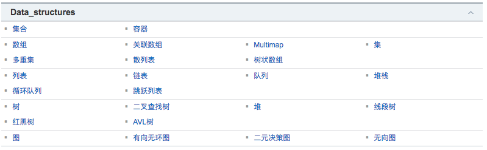

# 数据结构汇总

## 常用结构有哪些？8个
[百度百科](http://baike.baidu.com/link?url=HB85AItcvXVNE2FnsD3pyIdSHTka3nbRclDRk8qKdY5Vk6mzvzTPmvpDZnL2uDx7Kl27uA3QD6NOL8xkTJOdXCWr88vEagVgQRT7XVBo1RkuZFlggLy4ktQfjhQh3N49#7)

- 数组
- 栈
- 队列
- 链表
- 树
- 图
- 堆
- 散列表

## 资源

[CSDN　专栏](http://blog.csdn.net/column/details/datastructure.html)

[JAVA常用数据结构及原理分析](http://blog.csdn.net/lj745280746/article/details/46654519)

https://github.com/mazouri/SeniorAndroidDev/tree/master/java/list_collection_map_set

## 这些数据结构是什么？
http://www.cnblogs.com/Yellow-ice/p/5326856.html

## 各种数据结构优缺点？
http://www.xuebuyuan.com/2218977.html
