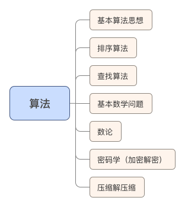

# 算法

算法
｜－－－ 基本算法思想
｜&ensp; &ensp; &ensp; &ensp; &ensp; &ensp;｜－－ 穷举
｜&ensp; &ensp; &ensp; &ensp; &ensp; &ensp;｜－－ 递推
｜&ensp; &ensp; &ensp; &ensp; &ensp; &ensp;｜－－ 递归
｜&ensp; &ensp; &ensp; &ensp; &ensp; &ensp;｜－－ 分治
｜&ensp; &ensp; &ensp; &ensp; &ensp; &ensp;｜－－ 概率
｜－－－ 排序算法
｜&ensp; &ensp; &ensp; &ensp; &ensp; &ensp;｜－－ 冒泡
｜&ensp; &ensp; &ensp; &ensp; &ensp; &ensp;｜－－ 选择
｜&ensp; &ensp; &ensp; &ensp; &ensp; &ensp;｜－－ 插入
｜&ensp; &ensp; &ensp; &ensp; &ensp; &ensp;｜－－ Shell
｜&ensp; &ensp; &ensp; &ensp; &ensp; &ensp;｜－－ 快速
｜&ensp; &ensp; &ensp; &ensp; &ensp; &ensp;｜－－ 堆
｜&ensp; &ensp; &ensp; &ensp; &ensp; &ensp;｜－－ 合并
｜&ensp; &ensp; &ensp; &ensp; &ensp; &ensp;｜－－ （反序）
｜－－－ 查找算法
｜&ensp; &ensp; &ensp; &ensp; &ensp; &ensp;｜－－ 顺序
｜&ensp; &ensp; &ensp; &ensp; &ensp; &ensp;｜－－ 折半
｜&ensp; &ensp; &ensp; &ensp; &ensp; &ensp;｜－－ 顺序表的查找
｜&ensp; &ensp; &ensp; &ensp; &ensp; &ensp;｜－－ 链表的查找
｜&ensp; &ensp; &ensp; &ensp; &ensp; &ensp;｜－－ 树的查找
｜&ensp; &ensp; &ensp; &ensp; &ensp; &ensp;｜－－ 图的查找
｜－－－ 基本数学问题
｜&ensp; &ensp; &ensp; &ensp; &ensp; &ensp;｜－－ 判断闰年
｜&ensp; &ensp; &ensp; &ensp; &ensp; &ensp;｜－－ 多项式计算（一维二维）
｜&ensp; &ensp; &ensp; &ensp; &ensp; &ensp;｜－－ 随机数生成
｜&ensp; &ensp; &ensp; &ensp; &ensp; &ensp;｜－－ 复数运算
｜&ensp; &ensp; &ensp; &ensp; &ensp; &ensp;｜－－ 阶乘
｜&ensp; &ensp; &ensp; &ensp; &ensp; &ensp;｜－－ 计算π的近似值
｜&ensp; &ensp; &ensp; &ensp; &ensp; &ensp;｜－－ 矩阵运算
｜&ensp; &ensp; &ensp; &ensp; &ensp; &ensp;｜－－ 方程求解（线性方程、非线性方程）
｜－－－ 数论
｜&ensp; &ensp; &ensp; &ensp; &ensp; &ensp;｜－－ 完全数
｜&ensp; &ensp; &ensp; &ensp; &ensp; &ensp;｜－－ 亲密数
｜&ensp; &ensp; &ensp; &ensp; &ensp; &ensp;｜－－ 水仙花数
｜&ensp; &ensp; &ensp; &ensp; &ensp; &ensp;｜－－ 自守数
｜&ensp; &ensp; &ensp; &ensp; &ensp; &ensp;｜－－ 最大公约数
｜&ensp; &ensp; &ensp; &ensp; &ensp; &ensp;｜－－ 最小公倍数
｜&ensp; &ensp; &ensp; &ensp; &ensp; &ensp;｜－－ 素数
｜&ensp; &ensp; &ensp; &ensp; &ensp; &ensp;｜－－ 回文素数
｜&ensp; &ensp; &ensp; &ensp; &ensp; &ensp;｜－－ 平方回文数
｜&ensp; &ensp; &ensp; &ensp; &ensp; &ensp;｜－－ 分解质因数
｜－－－ 密码学(加密解密)
｜－－－ 压缩解压缩
